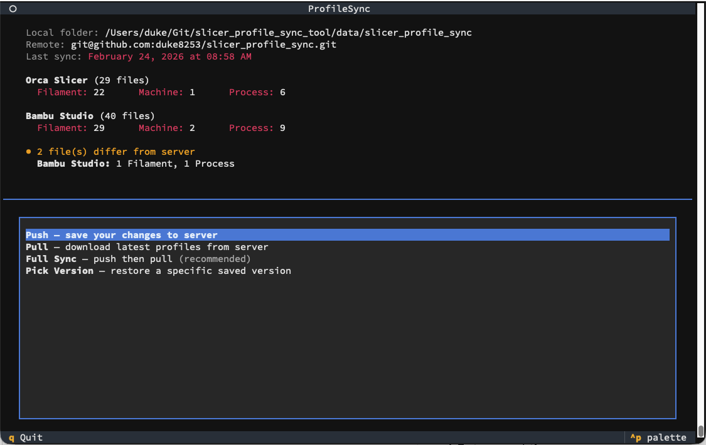
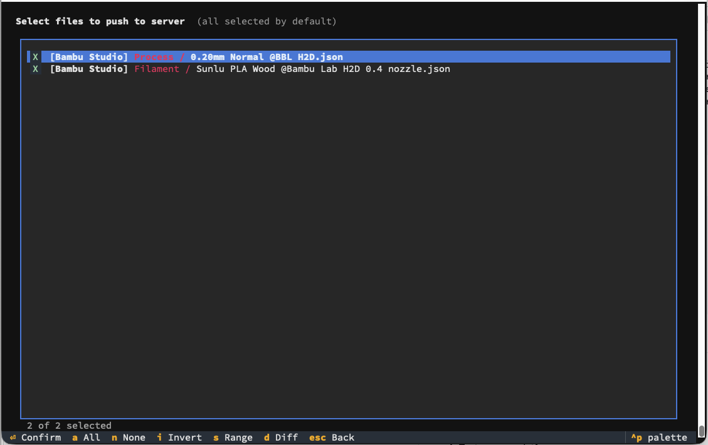
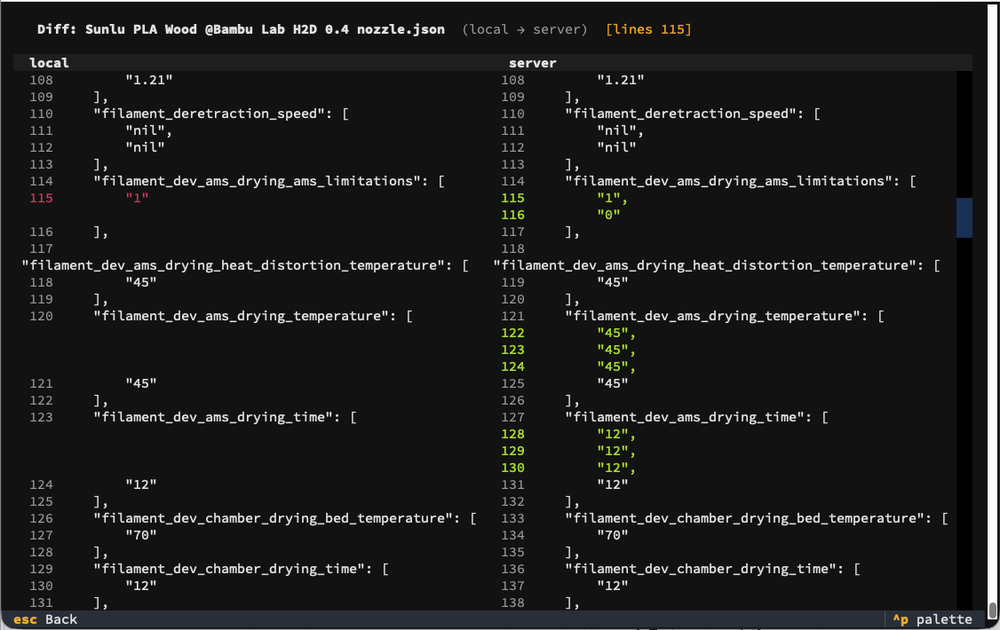
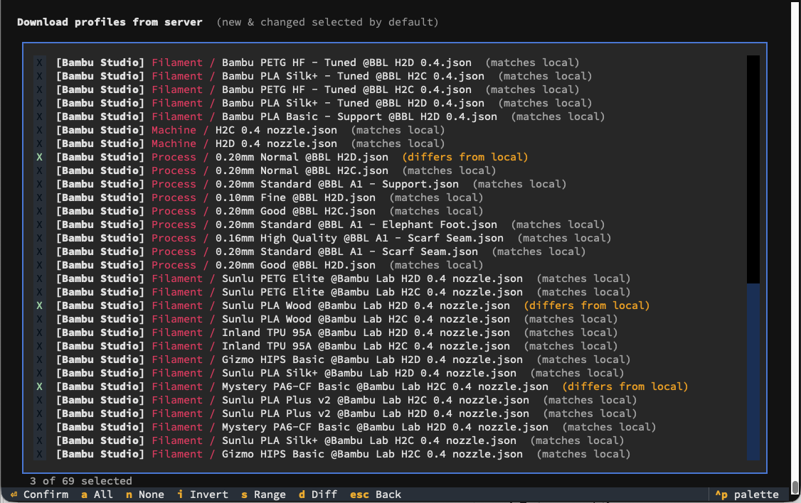

# Slicer Profile Sync Tool

A cross-platform Python tool to sync 3D printer slicer profiles (Orca Slicer, Bambu Studio, and more) across multiple computers using Git as the sync backend.

**Platforms:** macOS, Windows, Linux

## Why ProfileSync?

If you use multiple computers, you've probably experienced this:
- You tune a perfect filament profile on your desktop
- Go to print on your laptop... and it's not there
- Try to remember which machine has the latest settings
- Waste time manually copying .json files around

**ProfileSync** solves this by automatically syncing your slicer profiles across all your machines using Git (GitHub, GitLab, Gitea, or any Git server).

## Screenshots

| Main Screen | Push Screen |
|:-----------:|:-----------:|
|  |  |

| Side-by-Side Diff | Pull Screen |
|:------------------:|:-----------:|
|  |  |

## Key Features

- 🔄 **True Bidirectional Sync** - additions, modifications, AND deletions propagate
- 🖥️ **Interactive TUI** - full-screen terminal UI with file selection (powered by [Textual](https://textual.textualize.io/))
- 🔍 **Side-by-Side Diff Viewer** - compare local vs server versions with line numbers and change highlighting
- 🎨 **Organized Display** - files grouped by slicer and type (filament/process/machine)
- 💻 **Cross-platform** - macOS, Windows, Linux
- 🔍 **Auto-detection** of slicer profile directories
- 🌐 **Any Git Server** - GitHub, GitLab, Gitea, self-hosted, etc.
- 💬 **User-friendly language** - no git jargon, just "local" and "server"
- ⚔️ **Interactive conflict resolution** - guided editor-based conflict fixing
- 📊 **Smart status display** - shows local vs server differences by slicer and type
- ⚡ **Hash-based deduplication** - only syncs what actually changed
- 📅 **Version history** - restore any previous profile version
- 🎯 **Multi-slicer support** - Orca Slicer, Bambu Studio, Snapmaker Orca, Creality Print, Elegoo Slicer
- 🔒 **Privacy first** - your profiles, your Git server, you control your data

## Supported Slicers

- **Orca Slicer** - Auto-detects user directories
- **Bambu Studio** - Auto-detects user directories
- **Snapmaker Orca** - Snapmaker's OrcaSlicer fork
- **Creality Print** - Auto-detects version 7.0 or 6.0
- **Elegoo Slicer** - Based on OrcaSlicer

### Profile Locations

**macOS:**
- Orca Slicer: `~/Library/Application Support/OrcaSlicer/user/<id>/`
- Bambu Studio: `~/Library/Application Support/BambuStudio/user/<id>/`
- Snapmaker Orca: `~/Library/Application Support/SnapmakerOrcaSlicer/user/<id>/`
- Creality Print: `~/Library/Application Support/Creality/Creality Print/7.0/`
- Elegoo Slicer: `~/Library/Application Support/ElegooSlicer/user/<id>/`

**Windows:**
- Orca Slicer: `%APPDATA%\OrcaSlicer\user\<id>\`
- Bambu Studio: `%APPDATA%\BambuStudio\user\<id>\`
- Snapmaker Orca: `%APPDATA%\SnapmakerOrcaSlicer\user\<id>\`
- Creality Print: `%APPDATA%\Creality\Creality Print\7.0\`
- Elegoo Slicer: `%APPDATA%\ElegooSlicer\user\<id>\`

**Linux:**
- Orca Slicer: `~/.config/OrcaSlicer/user/<id>/`
- Bambu Studio: `~/.config/BambuStudio/user/<id>/`
- Snapmaker Orca: `~/.config/SnapmakerOrcaSlicer/user/<id>/`
- Creality Print: `~/.config/Creality/Creality Print/7.0/`
- Elegoo Slicer: `~/.config/ElegooSlicer/user/<id>/`

All slicers support automatic detection of numeric user ID subdirectories.

## Requirements

- Python 3.7+
- [Textual](https://textual.textualize.io/) (installed via `requirements.txt`)
- Git CLI installed
  - **macOS**: Xcode Command Line Tools or Homebrew git
  - **Windows**: [Git for Windows](https://git-scm.com/download/win)
  - **Linux**: `sudo apt install git` or equivalent
- Git repository for storing profiles (GitHub, GitLab, Gitea, etc.)
- SSH keys configured (recommended) or HTTPS credentials

## Installation

### macOS / Linux

```bash
# Clone this repository
git clone https://github.com/yourusername/slicer_profile_sync_tool.git
cd slicer_profile_sync_tool

# Install dependencies (for colored output)
pip3 install -r requirements.txt

# Make the script executable
chmod +x profilesync.py
```

### Windows

```powershell
# Clone this repository
git clone https://github.com/yourusername/slicer_profile_sync_tool.git
cd slicer_profile_sync_tool

# Install dependencies (enables colored output on Windows)
pip install -r requirements.txt

# Run directly with Python (no chmod needed on Windows)
python profilesync.py
```

## Quick Start

### 1. Create a Git Repository

Create a **private** repository on GitHub, GitLab, or your preferred Git server. Your profiles may contain sensitive information, so keep it private!

Example SSH URL: `git@github.com:yourusername/slicer-profiles.git`

### 2. Initial Setup

**macOS / Linux:**
```bash
./profilesync.py init
```

**Windows:**
```powershell
python profilesync.py init
```

This will:
1. Validate your Git repository access
2. Auto-detect slicer profile directories
3. Let you select which slicers to sync
4. Configure your preferred editor for conflict resolution
5. Clone your repository locally

### 3. Sync Your Profiles

**macOS / Linux:**
```bash
./profilesync.py sync
```

**Windows:**
```powershell
python profilesync.py sync
```

You'll see a full-screen interactive TUI showing:
- Current sync status (local vs server, last sync time)
- Files grouped by slicer and type (filament/process/machine)
- Per-type breakdown of changed files

Menu options:
1. **Push** - Save your local profiles to the server (with file selection)
2. **Pull** - Download latest profiles from server (with file selection)
3. **Full Sync** - Push then pull (recommended)
4. **Pick Version** - Restore a specific saved version

### File Selection Keybindings

When selecting files to push or pull:

| Key | Action |
|-----|--------|
| **Space** | Toggle highlighted item |
| **a** | Select all |
| **n** | Deselect all |
| **i** | Invert selection |
| **s** | Range select — press once to set anchor, move cursor, press again to select range |
| **d** | Show side-by-side diff for highlighted file |
| **Enter** | Confirm selection |
| **Esc** | Go back |

### 4. On Your Other Computer

Repeat steps 2-3. ProfileSync will sync all your profiles!

## How It Works

1. **Local Storage**: Profiles are cloned to `./data/<repo-name>/`
2. **Structure**: Files are organized as `profiles/<slicer>/<type>/*.json`
   - Example: `profiles/orcaslicer/filament/PLA Basic.json`
3. **Sync Logic**:
   - **Export**: Copy `.json` files from slicer → local repo (including deletions)
   - **Push**: Commit and push changes to server
   - **Pull**: Download from server and rebase local changes
   - **Import**: Copy `.json` files from local repo → slicer (including deletions)
4. **Conflict Detection**: If both computers modified the same profile, interactive resolution

## Usage Examples

### View Current Configuration

```bash
./profilesync.py config
```

Shows your current settings in JSON format.

### Push Only (Save to Server)

```bash
./profilesync.py sync --action push
```

### Pull Only (Download from Server)

```bash
./profilesync.py sync --action pull
```

### Restore a Previous Version

```bash
./profilesync.py sync --action pick
```

Lists the last 20 saved versions with timestamps. Select one to restore to your slicer.

### Non-Interactive Sync (CLI Mode)

When using `--action`, ProfileSync runs in non-interactive CLI mode (no TUI):

```bash
./profilesync.py sync --action both
```

Automatically push then pull without prompting.

## Configuration

Config is stored in `./config.json` (gitignored):

```json
{
  "github_remote": "git@github.com:user/slicer-profiles.git",
  "repo_dir": "./data/slicer-profiles",
  "enabled_slicers": ["orcaslicer", "bambustudio"],
  "slicer_profile_dirs": {
    "orcaslicer": ["/Users/you/Library/Application Support/OrcaSlicer/user/12345"],
    "bambustudio": ["/Users/you/Library/Application Support/BambuStudio/user/12345"]
  },
  "editor_cmd": "code --wait"
}
```

## Sync Status Display

ProfileSync shows a clear status using "local" and "server" terminology — no git jargon:

```
Sync status:
  Local folder:  ./data/slicer-profiles
  Remote server: git@github.com:user/slicer-profiles.git
  Last sync:     January 31, 2026 at 02:45 PM

  Orca Slicer (36 files)
    Filament: 19  Process: 12  Machine: 5

  Bambu Studio (27 files)
    Filament: 15  Process: 8  Machine: 4

  ✓ Local profiles match server
  ✓ Everything is synced
```

If there are changes:
```
  ● 5 file(s) differ from server
    Orca Slicer: 2 Filament, 1 Process
    Bambu Studio: 1 Filament, 1 Process
  ↓ Server has 2 newer update(s)
```

## Side-by-Side Diff Viewer

Press **d** on any highlighted file in the push or pull screen to see a side-by-side diff:

- **Left pane**: local version
- **Right pane**: server version
- **Line numbers** shown for both sides
- **Red** lines = removed, **Green** lines = added
- Changed line ranges shown in the title bar
- Scroll both panes together

## Conflict Resolution

When sync conflicts occur (profiles modified on multiple computers), ProfileSync:

1. Detects conflicts automatically during push/pull
2. Groups conflicted files by slicer and type
3. Opens each file in your configured editor
4. Shows conflict markers: `<<<<<<<`, `=======`, `>>>>>>>`
5. Guides you through resolving and committing

Supported editors:
- **VS Code**: `code --wait`
- **Vim**: `vim`
- **Nano**: `nano`
- **Sublime Text**: `subl -w`
- Custom command

## Deletion Behavior

ProfileSync handles deletions in both directions:

**Push (Slicer → Server):**
- Delete a profile in your slicer
- Run sync → push
- The profile is removed from the server
- Shows as "deleted" in the file list

**Pull (Server → Slicer):**
- Currently: deletions from server do NOT remove files from your slicer (planned feature)
- Workaround: manually delete unwanted profiles after pulling

## Troubleshooting

### "Git not found"
Install Git: https://git-scm.com/downloads

### "Permission denied (publickey)"
Set up SSH keys: https://docs.github.com/en/authentication/connecting-to-github-with-ssh

### "No slicer directories found"
Manually specify the path during `init`, or check that your slicer is installed.

### Colors not working on Windows
Make sure `colorama` is installed: `pip install colorama`

### Merge conflicts every sync
This happens when both computers modify the same profiles. Use "Pick version" to choose one authoritative version, then sync normally.

## Privacy & Security

- **Use private repositories** - your profiles may contain printer info, API keys, etc.
- **SSH recommended** - more secure than HTTPS passwords
- **No telemetry** - this tool doesn't send any data anywhere except your Git server
- **You control everything** - your profiles, your Git server, your data

## Color Scheme

ProfileSync uses colors for better readability (auto-disables when piped):

- 🟢 **Green** - Success messages (✓)
- 🟣 **Magenta** - Info/counts ("17 files")
- 🔵 **Blue** - Dimmed labels ("Last sync:")
- 🟡 **Yellow** - Warnings (⚠)
- 🔴 **Red** - Errors (✗)
- **Bold White** - Highlighted text (slicer names, actions)

## Development

### Project Structure

```
slicer_profile_sync_tool/
├── profilesync.py          # Main entry point
├── profilesync/            # Core package
│   ├── __init__.py        # Package exports
│   ├── commands.py        # CLI command implementations
│   ├── config.py          # Configuration management
│   ├── git.py             # Git operations
│   ├── slicers.py         # Slicer detection
│   ├── sync.py            # File sync operations
│   ├── tui.py             # Textual TUI (interactive sync screens)
│   └── ui.py              # UI helpers (colors, prompts)
├── config.json            # User config (gitignored)
├── data/                  # Cloned repos (gitignored)
├── requirements.txt       # Python dependencies
├── LICENSE                # Apache 2.0
└── README.md             # This file
```

### Running Tests

```bash
# Test imports
python3 -c "from profilesync import *"

# Test CLI help
./profilesync.py --help

# Dry run init (will prompt for input)
./profilesync.py init
```

## Contributing

Contributions welcome! Please:
1. Fork the repo
2. Create a feature branch
3. Make your changes
4. Test on your platform
5. Submit a pull request

## Future Enhancements
- Packaging as standalone executable

## License

Apache License 2.0 - See [LICENSE](LICENSE) file for details.

## Credits

Created to solve the multi-computer slicer profile sync problem. Built with Python, Git, and frustration from manually copying JSON files. 🎨🖨️

## Support

- **Issues**: https://github.com/yourusername/slicer_profile_sync_tool/issues
- **Discussions**: https://github.com/yourusername/slicer_profile_sync_tool/discussions

---

**Happy Printing! 🎨🖨️**
