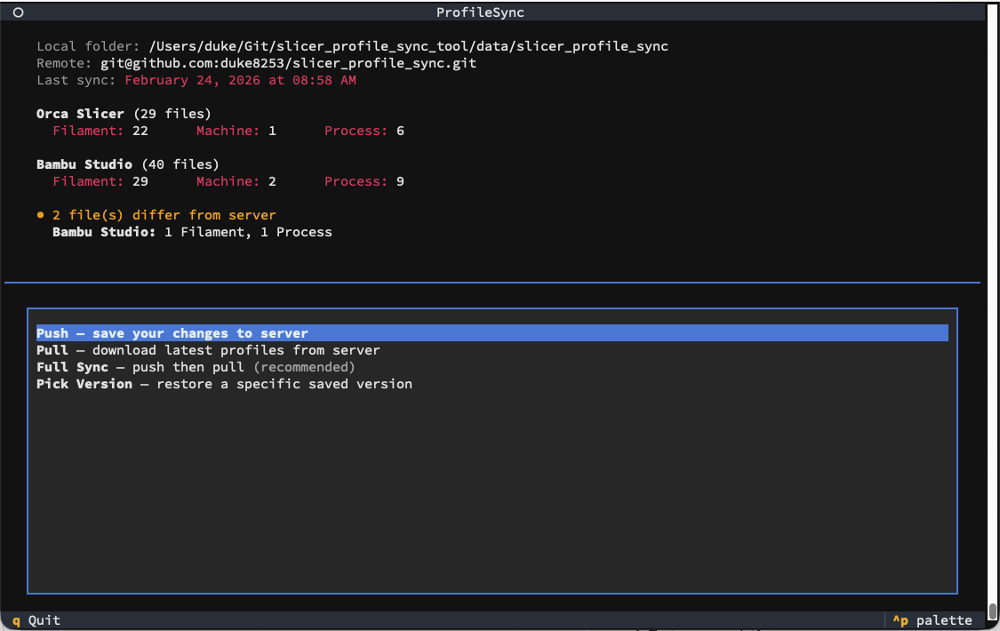
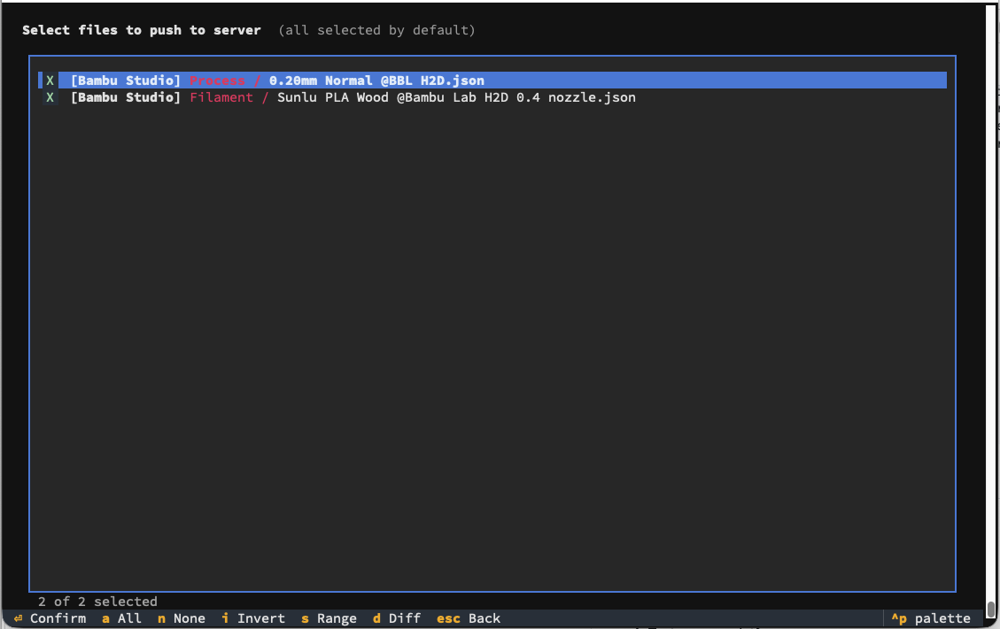
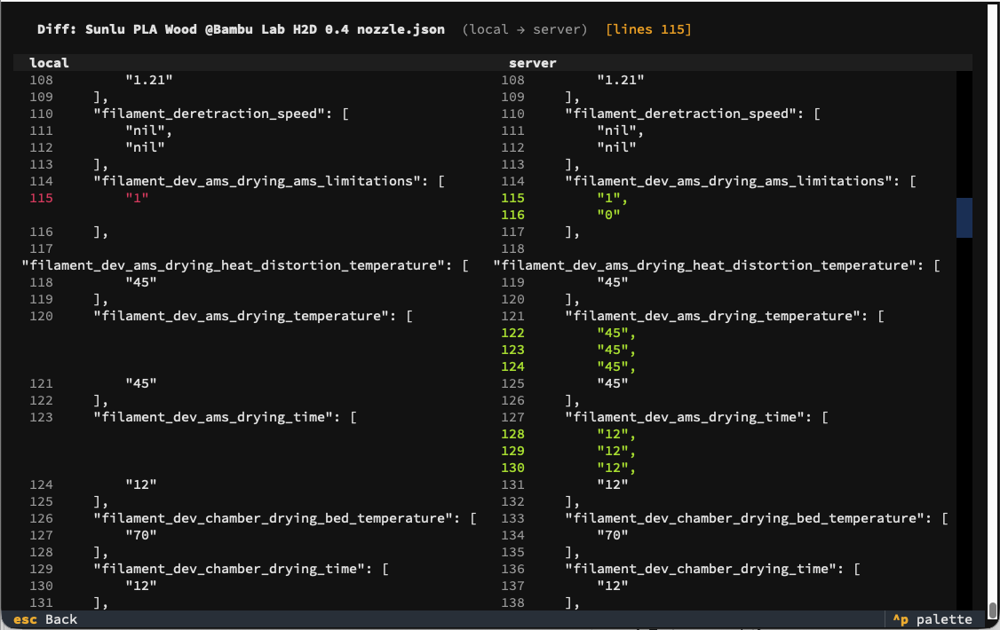
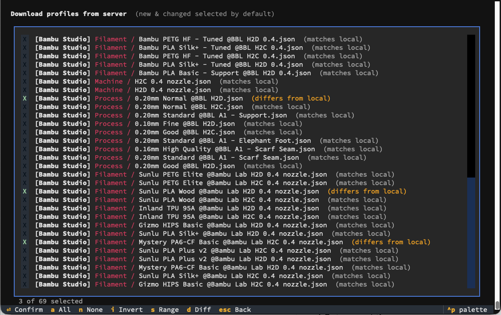

# Slicer Profile Sync Tool

A cross-platform Python tool to sync 3D printer slicer profiles (Orca Slicer, Bambu Studio, and more) across multiple computers using Git as the sync backend.

**Platforms:** macOS, Windows, Linux

## Why ProfileSync?

If you use multiple computers, you've probably experienced this:
- You tune a perfect filament profile on your desktop
- Go to print on your laptop... and it's not there
- Try to remember which machine has the latest settings
- Waste time manually copying .json files around

**ProfileSync** solves this by syncing your slicer profiles across all your machines using Git (GitHub, GitLab, Gitea, or any Git server).

## Screenshots

| Main Screen | Push Screen |
|:-----------:|:-----------:|
|  |  |

| Side-by-Side Diff | Pull Screen |
|:------------------:|:-----------:|
|  |  |

## Key Features

- 🖥️ **Interactive TUI** — full-screen terminal UI with file selection, powered by [Textual](https://textual.textualize.io/)
- 🔄 **Bidirectional Sync** — additions, modifications, and deletions propagate in both directions
- 🔍 **Side-by-Side Diff Viewer** — compare local vs server with line numbers, context-only or full-file mode
- 🎨 **Organized Display** — files grouped by slicer and type (filament / process / machine)
- 📅 **Version History** — restore any previous profile version
- 🎯 **Multi-Slicer** — Orca Slicer, Bambu Studio, Snapmaker Orca, Creality Print, Elegoo Slicer
- 💻 **Cross-Platform** — macOS, Windows, Linux
- 🌐 **Any Git Server** — GitHub, GitLab, Gitea, self-hosted, etc.
- 💬 **User-Friendly** — no Git jargon, just "local" and "server"
- ⚡ **Hash-Based Dedup** — only syncs what actually changed
- 🔒 **Privacy First** — your profiles, your Git server, you control your data

## Supported Slicers

| Slicer | Auto-Detect | Notes |
|--------|:-----------:|-------|
| **Orca Slicer** | ✅ | User directories |
| **Bambu Studio** | ✅ | User directories |
| **Snapmaker Orca** | ✅ | Snapmaker's OrcaSlicer fork |
| **Creality Print** | ✅ | v7.0 and v6.0 |
| **Elegoo Slicer** | ✅ | Based on OrcaSlicer |

<details>
<summary>Profile Locations</summary>

**macOS:**
| Slicer | Path |
|--------|------|
| Orca Slicer | `~/Library/Application Support/OrcaSlicer/user/<id>/` |
| Bambu Studio | `~/Library/Application Support/BambuStudio/user/<id>/` |
| Bambu Studio Beta | `~/Library/Application Support/BambuStudioBeta/user/<id>/` |
| Snapmaker Orca | `~/Library/Application Support/Snapmaker_Orca/user/<id>/` |
| Creality Print | `~/Library/Application Support/Creality/Creality Print/7.0/` |
| Elegoo Slicer | `~/Library/Application Support/ElegooSlicer/user/<id>/` |

**Windows:**
| Slicer | Path |
|--------|------|
| Orca Slicer | `%APPDATA%\OrcaSlicer\user\<id>\` |
| Bambu Studio | `%APPDATA%\BambuStudio\user\<id>\` |
| Bambu Studio Beta | `%APPDATA%\BambuStudioBeta\user\<id>\` |
| Snapmaker Orca | `%APPDATA%\Snapmaker_Orca\user\<id>\` |
| Creality Print | `%APPDATA%\Creality\Creality Print\7.0\` |
| Elegoo Slicer | `%APPDATA%\ElegooSlicer\user\<id>\` |

**Linux:**
| Slicer | Path |
|--------|------|
| Orca Slicer | `~/.config/OrcaSlicer/user/<id>/` |
| Bambu Studio | `~/.config/BambuStudio/user/<id>/` |
| Bambu Studio Beta | `~/.config/BambuStudioBeta/user/<id>/` |
| Snapmaker Orca | `~/.config/Snapmaker_Orca/user/<id>/` |
| Creality Print | `~/.config/Creality/Creality Print/7.0/` |
| Elegoo Slicer | `~/.config/ElegooSlicer/user/<id>/` |

All slicers support automatic detection of numeric user ID subdirectories.
</details>

## Requirements

- **Python 3.9+**
- **Git** installed and on PATH
  - macOS: Xcode Command Line Tools or `brew install git`
  - Windows: [Git for Windows](https://git-scm.com/download/win)
  - Linux: `sudo apt install git` or equivalent
- A Git repository for storing profiles (GitHub, GitLab, Gitea, etc.)
- SSH keys configured (recommended) or HTTPS credentials

## Installation

**macOS / Linux:**
```bash
git clone https://github.com/duke8253/slicer_profile_sync_tool.git
cd slicer_profile_sync_tool
pip3 install -r requirements.txt
chmod +x profilesync.py
```

**Windows:**
```powershell
git clone https://github.com/duke8253/slicer_profile_sync_tool.git
cd slicer_profile_sync_tool
pip install -r requirements.txt
```

## Quick Start

### 1. Create a Git Repository

Create a **private** repository on GitHub, GitLab, or your preferred Git server. Your profiles may contain sensitive information, so keep it private!

### 2. Initial Setup

```bash
# macOS / Linux
./profilesync.py init

# Windows
python profilesync.py init
```

This will:
1. Validate your Git repository access
2. Auto-detect slicer profile directories
3. Let you select which slicers to sync
4. Configure your preferred editor for conflict resolution
5. Clone your repository locally

You can also pass flags directly:
```bash
./profilesync.py init --remote git@github.com:user/slicer-profiles.git
```

### 3. Sync Your Profiles

```bash
# macOS / Linux
./profilesync.py sync

# Windows
python profilesync.py sync
```

This launches the interactive TUI.

### 4. On Your Other Computer

Repeat steps 2–3. ProfileSync will sync all your profiles!

## Using the TUI

### Main Screen

The main screen shows your sync status and provides four actions, selectable by number key or arrow+Enter:

| Key | Action | Description |
|-----|--------|-------------|
| **1** | Push | Save local changes to server |
| **2** | Pull | Download latest profiles from server |
| **3** | Full Sync | Push then pull (recommended) |
| **4** | Pick Version | Restore a specific saved version |
| **r** | Refresh | Re-scan slicer folders for changes |
| **q** | Quit | Exit the app |

### Push / Pull Screens

Both screens show a file list grouped by slicer and type. Changed and new files are pre-selected.

| Key | Action |
|-----|--------|
| **Space** | Toggle highlighted item |
| **a** | Select all |
| **n** | Deselect all |
| **i** | Invert selection |
| **s** | Range select (press once to anchor, move, press again) |
| **d** | Side-by-side diff for highlighted file |
| **Enter** | Confirm selection |
| **Esc** | Go back |

The **Pull screen** also has:

| Key | Action |
|-----|--------|
| **f** | Toggle filter: show only changed/new files (default) or all files |

### Diff Viewer

Press **d** on any file to see a side-by-side diff:

- Left pane = local, right pane = server
- Line numbers on both sides
- Red = removed, green = added
- Changed line ranges shown in the title
- Default: context-only view (changed lines ± 3 surrounding lines)

| Key | Action |
|-----|--------|
| **f** | Toggle between context-only and full-file view |
| **Esc** | Go back |

## How It Works

1. **Export** — copy `.json` profiles from your slicer folders into a local Git repo
2. **Push** — commit and push changes to your Git server
3. **Pull** — pull latest from server, rebase if needed
4. **Import** — copy `.json` profiles from the local repo back into slicer folders

Files are organized as `profiles/<slicer>/<type>/<name>.json`, for example:
```
profiles/orcaslicer/filament/PLA Basic.json
profiles/bambustudio/process/0.20mm Standard.json
```

Deletions propagate in both directions — if you delete a profile in your slicer and push, it's removed from the server.

## Configuration

Config is stored in `config.json` (gitignored):

```json
{
  "github_remote": "git@github.com:user/slicer-profiles.git",
  "repo_dir": "./data/slicer-profiles",
  "enabled_slicers": ["orcaslicer", "bambustudio"],
  "slicer_profile_dirs": {
    "orcaslicer": ["~/Library/Application Support/OrcaSlicer/user/12345"],
    "bambustudio": ["~/Library/Application Support/BambuStudio/user/12345"]
  },
  "editor_cmd": "code --wait"
}
```

View your current config:
```bash
./profilesync.py config
```

## Conflict Resolution

When the same profile is modified on multiple computers, ProfileSync:

1. Detects conflicts automatically during push/pull
2. Groups conflicted files by slicer and type
3. Opens each file in your configured editor
4. Shows conflict markers (`<<<<<<<`, `=======`, `>>>>>>>`)
5. Guides you through resolving and committing

Supported editors: VS Code (`code --wait`), Vim, Nano, Sublime Text (`subl -w`), or any custom command.

## Troubleshooting

| Problem | Solution |
|---------|----------|
| "Git not found" | Install Git: https://git-scm.com/downloads |
| "Permission denied (publickey)" | Set up SSH keys: https://docs.github.com/en/authentication/connecting-to-github-with-ssh |
| "No slicer directories found" | Manually specify the path during `init` |
| Merge conflicts every sync | Use "Pick Version" to choose one authoritative version, then sync normally |

## Project Structure

```
slicer_profile_sync_tool/
├── profilesync.py          # CLI entry point
├── profilesync/            # Core package
│   ├── __init__.py
│   ├── commands.py         # CLI commands (init, sync, config)
│   ├── config.py           # Configuration management
│   ├── git.py              # Git operations
│   ├── slicers.py          # Slicer detection & paths
│   ├── sync.py             # Export/import logic
│   ├── tui.py              # Textual TUI screens
│   └── ui.py               # Terminal colors & prompts
├── config.json             # User config (gitignored)
├── data/                   # Cloned repos (gitignored)
├── requirements.txt
├── LICENSE
└── README.md
```

## License

Apache License 2.0 — see [LICENSE](LICENSE) for details.

## Support

- **Issues**: https://github.com/duke8253/slicer_profile_sync_tool/issues
- **Discussions**: https://github.com/duke8253/slicer_profile_sync_tool/discussions

---

**Happy Printing! 🎨🖨️**
